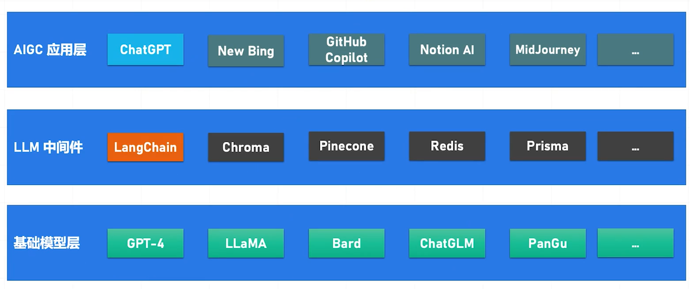

# 《AI 大模型应用开发实战营》学习笔记

> 极客时间 彭靖田

课程内容包含理论基础、开发基础、应用实战、开源生态

- 技术栈：
  

本项目旨在指导你进行使用 OpenAI API 的应用开发的初始步骤。它将帮助你设置开发环境，理解如何使用API，并为你提供一个用于交互式开发的Jupyter Lab记事本。

## 快速开始

### 设置环境变量

为了使用 OpenAI API，你需要从 OpenAI 控制台获取一个 API 密钥, 为防止密钥泄露建议将其设置为环境变量使用：

对于基于Unix的系统（如Ubuntu或MacOS），你可以在终端中运行以下命令：

```bash
export OPENAI_API_KEY='你的-api-key'
```

对于Windows，你可以在命令提示符中使用以下命令：

```bash
# cmd
set OPENAI_API_KEY=your_api_key

# powershell
$env:OPENAI_API_KEY = "your_api_key"
```

请确保将`your_api_key`替换为你的实际 OpenAI API 密钥。

### 创建虚拟环境

```bash
python -m venv .venv
```

### 安装Jupyter Lab

我们将使用Jupyter Lab作为我们的交互式开发环境。你可以使用pip进行安装：

```bash
pip install jupyterlab
```

### 启动Jupyter Lab

切换到本项目录并通过运行以下命令启动Jupyter Lab：

```bash
cd openai-quickstart
jupyter-lab
```

这将启动 Jupyter Lab 并在你的默认网络浏览器中打开它。
