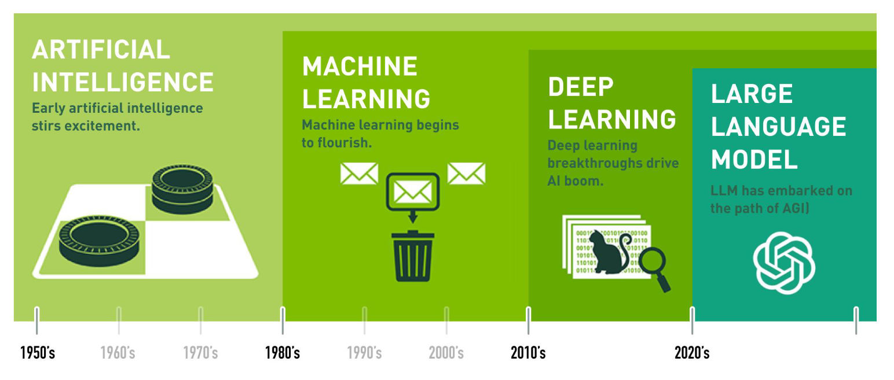
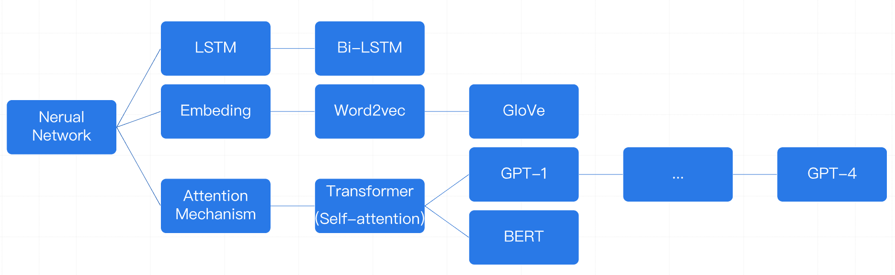
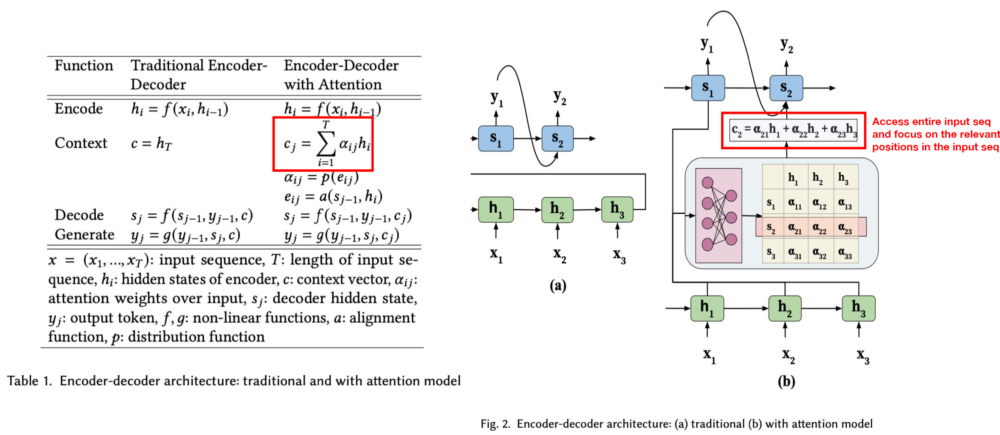
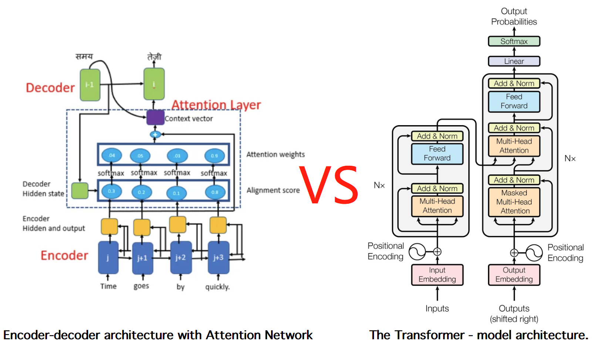
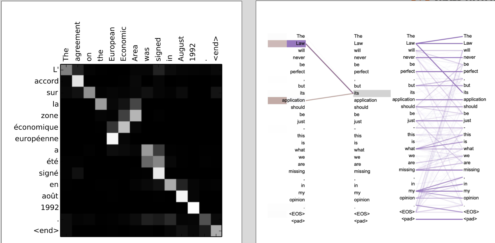
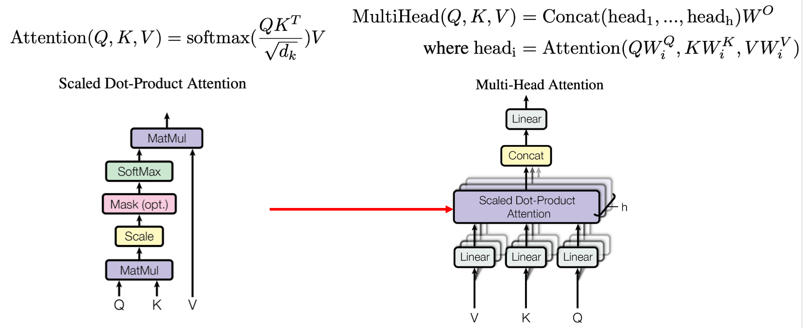

# 大模型基础：理论与技术的演进概述

## 人工智能发展历程

人工智能发展历程可以概括为以下几个主要阶段:

1. 起源阶段(1956-1980年代)，这一时期被称为人工智能的“黄金时代”,  达特茅斯会议首次提出人工智能概念, 开发出传统人工智能系统, 如ELIZA、深蓝等。
2. 知识爆炸时期(1980-1987年代)，这一时期专家系统成为主流人工智能应用,依靠人工构建知识库实现有限的智能。但随后出现知识获取瓶颈问题。
3. 第一极端冬天时期(1987-1993年代)，这一时期由于知识获取瓶颈, 缺乏计算力支持等原因, 人工智能陷入低迷。称为第一极端冬天时期。
4. 统计学习兴起时期(1997年后)，1990年代后期, 神经网络和支持向量机等统计学习方法兴起并得到发展,人工智能逐渐复苏。
5. 深度学习繁荣时期(2006年后)，Hinton等人提出深度学习训练方法,GPU性能提升,让深度学习模型性能大幅提升,人工智能进入快速发展阶段。
6. 大模型时代(2020年始)，大规模语言模型 GPT-3 等大模型的出现, 使得人工智能系统拥有更强的迁移学习与泛化能力,应用场景不断拓展, 人工智能进入大模型时代。

人工智能技术仍在快速发展中,未来将进一步深入各行各业,并面临算法、计算力、伦理等挑战。

### 自然语言处理进展

近10年，深度学习在各个领域都取得了令人瞩目的成绩，如图像识别、语音识别等领域都早已突破人类基准。在自然语言处理领域，直到 2018 年一些任务的人类基准值才被突破，之所以来的晚的一个重要原因是自然语言处理任务繁多，可以归为五大类任务：分类、匹配、翻译、结构化预测和序列决策任务，在监督学习的场景下，每一类任务所使用的训练数据和模型不尽相同，并且需要大量已标注的数据。缺乏大规模标注数据是一大难题，但却可轻易获取大规模的无标注数据，如果能利用这些数据，就能大幅提升自然语言处理任务的效果。预训练的大语言模型正好满足了这一要求，通过多无标签的大规模文本训练出通用的语言表示，再通过微调的方式进行下游领域任务的适配，这种范式在自然语言处理各类任务中都取得了良好效果。

![[nlp.png]]

## 一、大模型概述

### 什么是大模型及其特点

**大语言模型（英文：Large Language Model，缩写LLM）** 是指参数规模极大的神经网络语言模型，大模型的基础理论主要包括深度学习理论、表示学习理论、迁移学习理论、模式识别理论、计算学习理论、分布式计算理论和统计语言模型理论,大模型集成了这些计算机科学核心理论的精华。通过大数据预训练加小数据微调，大大降低了使用门槛，将人工智能技术带入了一个新的阶段，其主要特点如下:

1. 参数量大，大模型的参数量通常达到百亿量级甚至千亿量级,远超传统语言模型。如GPT-3拥有1750亿参数。
2. 训练数据量大，大模型需要海量标注语料进行预训练,数据量通常达到TB级甚至PB级。
3. 计算能力需求高，需要大量GPU/TPU进行分布式并行训练,一般企业级GPU集群难以满足。
4. 可进行迁移学习，通过在大量语料上预训练得到通用语言表示,可迁移到下游任务。
5. 泛化能力强，大模型可以根据上下文进行推理、总结、应用,拥有较强的泛化能力。
6. 应用广泛，可用于机器翻译、对话、知识问答、文本生成等多种自然语言处理任务。
7. 计算成本高，大模型的训练和使用成本非常高,对计算资源要求极大。

### 大语言模型的发展历程

大语言模型的发展历程可以分为以下几个阶段:

1. 起步阶段(2010年前)，这一阶段神经网络语言模型刚刚出现,主要是简单的RNN和LSTM模型,参数量在百万量级。例如早期的Word2Vec词向量模型。
2. 发展探索期(2010-2017年)，这一时期开始出现参数达到亿量级的模型,如ELMo使用双向LSTM和BERT使用Transformer结构。参数量达到3.4亿(ELMo)和1.1亿(BERT)。
3. 预训练模型兴起期(2018-2020年)，GPT系列模型(OpenAI GPT,GPT-2,GPT-3)等语言模型出现,利用大规模语料预训练后可迁移至下游任务。参数量达到175亿(GPT-3)。
4. 百亿级模型时代(2020年至今)，这个时期出现了百亿级甚至千亿级参数的语言模型,如Switch Transformer,PALM,Gopher等。计算力也得到大幅提升。
5. 多模态融合期(未来)，未来语言模型将向多模态发展,不仅处理文本,还可以处理图像、音频、视频数据,实现多感官的理解和生成。

大语言模型仍在快速演进中,模型规模、性能和应用范围还会不断扩大。

### 大语言模型与传统AI模型的区别

大语言模型与传统AI模型的主要区别有:

1. 模型规模差异巨大，大语言模型的参数量达到百亿级甚至千亿级,远超传统模型的百万到千万量级参数。
2. 依赖大规模标注语料，大语言模型训练需要大量高质量标注语料,传统模型可利用较小数据集。
3. 计算力需求差异极大，大语言模型需要分布式训练集群,传统模型可在单GPU上训练。
4. 训练方式不同，大语言模型更依赖预训练+微调,而传统模型通常从头训练。
5. 泛化能力差异，大语言模型可推理、总结,拥有更强大的泛化能力。传统模型泛化能力相对有限。

### 大模型应用的重要性和挑战

大模型应用有着重要意义,但也面临一些挑战

重要性:

1. 极大拓展了人工智能的应用范围, 使很多任务自动化成为可能。
2. 大幅提高了许多领域的效率,降低使用门槛。
3. 为科研、教育、文创、交互等提供强大工具。
4. 推动计算机视觉、语音、NLP等核心技术快速发展。
5. 对经济发展、社会进步产生深远影响。

挑战:

1. 需要大规模计算资源支持,对硬件提出更高要求。
2. 依赖大量高质量训练集,数据获取和处理非常关键。
3. 模型训练需要复杂的软件系统支持,算法也面临瓶颈。
4. 应用部署和维护成本高,需要商业化运作。
5. 模型的解读性差,存在偏见风险,需要提高可解释性和可控制性。
6. 法律规范和伦理规范亟待建立,确保其合理合法应用。

总体来说,大模型应用前景广阔但挑战同在,需要社会各界共同努力推动其健康发展。

## 大模型基本概念

- 预训练(Pre-training):在大量语料上进行无监督的训练,获得通用的语言表示。
- 微调(Fine-tuning):在预训练的基础上,使用下游任务的数据进行监督微调。
- Transformer:基于注意力机制的序列建模结构,是大模型的典型基础架构。
- 参数量(Parameters):大模型的参数或可训练权重的数量,通常达到百亿级甚至千亿级。
- FLOPS:表示模型的计算量,大模型通常需要数万亿级甚至更高的FLOPS。
 - tokenize:将文本分割成词元的过程,大模型输入前需要进行tokenize。
- embedding:将输入映射到向量空间的表示,大模型第一层通常是embedding。
- 下游任务(Downstream task):指基于预训练模型进行迁移的具体使用任务。
- 多任务学习(Multi-task learning):一个模型同时学习多个相关任务的能力。
- 计算效率(Compute efficiency):指训练一个模型达到一定效果需要的计算量。大模型追求更高的计算效率。

这些是理解大模型的一些关键概念,总体来说大模型是通过架构设计、大规模预训练和计算力支持达到强大语言能力的。

## 关键基础技术

### 注意力机制

注意力机制增强了神经网络对关键信息的识别和利用能力, 是大模型的核心组成部分，注意力机制的主要作用有:

1. 聚焦重要信息，注意力机制可以让模型自动学习输入信息的重要程度,对重要部分给予更高的注意力权重,实现对关键信息的聚焦。
2. 捕捉全局依赖关系，注意力机制可以建模输入序列中的全局依赖,通过学习任意两个位置的相关性来捕捉长距离依赖关系。
3. 提高上下文感知能力，注意力通过表示输入序列的上下文信息,增强了模型对上下文的感知和理解能力。
4. 提升长序列建模能力，注意力机制强化了序列模型处理较长序列的能力,缓解了长序列在递归神经网络中的梯度消失问题。
5. 引入外部知识，注意力可以引入外部知识作为值,增强模型的知识感知能力。
6. 减少计算量，相比全连接结构,注意力机制大幅减少了计算复杂度和参数量。
7. 解释性，注意力权重提供了一定的模型解释性,可以判断 keywords 和上下文的重要性。

注意力机制通常用于将一个查询与一组键值对进行匹配，并根据匹配程度来计算相应的权重，以便在序列或集合中获取相关的信息。

  - 查询（Q）是用于指定需要关注的内容或信息。它通过与键进行匹配来计算相应的权重。
  - 键（K）用于表示存储的信息或内容，用于与查询进行匹配并计算权重。
  - 值（V）则是与键对应的实际信息或内容。

**自注意力机制**(Self-Attention)是注意力机制的一种特例，主要思想是: 允许模型学习来自同一个序列的不同位置的相关性，并根据语义相关性动态地调整权重。相比传统的循环神经网络（RNN）或卷积神经网络（CNN），自注意力机制能够更有效地建模长距离依赖关系，因为它直接考虑了全局的语义信息。具体来说,自注意力机制的计算过程如下:

1. 将输入序列X通过线性映射,转化为查询向量Q、键向量K和值向量V。它们映射到同一表示空间中。
2. 计算注意力权重，计算查询向量Q和键向量K的点积或乘法, 经过归一化处理(如Softmax),得到注意力权重系数。权重反映查询词对键词的关注程度。
3. 加权求和得到输出，根据权重系数对对应的值向量V进行加权求和,得到最终的自注意力输出。权重越大的词语,其值向量在输出中的权重越大。

在自注意力中, 查询Q、键K和值V都来自同一个输入X,这就是“自”注意力的由来。

自注意力已经成为Transformer模型等大模型结构的核心组成部分。能够在没有显式序列顺序的情况下，同时考虑输入序列中的所有位置，并为每个位置生成丰富的上下文表示。这使得Transformer在处理自然语言处理任务时具有很强的表达能力和建模能力，增强了模型学习语言的长程依赖关系和内在关联的能力。在机器翻译、语音识别等任务上都产生了显著效果。

### Transformer

> **Attention Is All You Need**

语言是离散的符合，自然语言的表示学习，就是将人类的语言表示成更易于计算机理解的方式，尤其在深度学习兴起后，如何在网络的输入层更好的进行自然语言表示，成了值得关注的问题。从早期的基于统计的 n-gram模型、词袋模型，逐步发展到基于分布式表示的 word2vec、GloVe模型，使得判断语义相似度成为可能，开启了自然语言预训练的序章。但上下文无关的词向量模型无法很好地解决一词多义的问题，EMLo 模型考虑了上下文的词向量表示方法，以双向LSTM作为特征提取器，开启了第二代预训练语言模型的时代。后来基于自注意力机制的 Transformer 作为更强大的特征提取器，被应用于 GPT、BERT 等模型，不断刷新自然语言处理领域的 SOTA (当前最优结果)，将预训练大语言模型的效果提升到新的高度。

Transformer是2017年Google团队提出的一种基于自注意力机制的神经网络模型,主要创新和特点包括:

1. 引入Attention机制,实现序列建模而不需要RNN或CNN。
2. 基于Attention实现序列内部全连接,更好地建模长程依赖。
3. 采用自注意力机制(self-attention),直接学习序列本身的内在表示。
4. 多头注意力机制(multi-head attention)允许模型并行学习文本的不同表示子空间。
5. positional encoding编码单词在序列中的位置信息。
6. Encoder-Decoder架构,Encoder学习输入表示,Decoder进行顺序生成。
7. Layer Normalization层,preprocessing拥有更高学习稳定性。
8. Residual Connection残差连接,避免深层神经网络的梯度弥散问题。
9. Multi-GPU训练架构,支持大规模模型训练。

Transformer架构简化了序列建模的设计,依靠Attention以及大规模数据训练取得了SOTA的效果。已成为NLP各任务上不可或缺的基础模型

**自注意力**

### GPT 与 BERT 模型的区别

GPT(Generative Pre-Training)和BERT(Bidirectional Encoder Representations from Transformers)都是i优秀的预训练语言模型,主要区别在于:

1. 网络结构上:
	- GPT采用transformer decoder结构,BERT采用transformer encoder结构。
	- GPT只能建模单向context,BERT可以建模双向context。
2. 预训练目标上:
	- GPT通过联合预测下一个词来进行预训练。
	- BERT通过掩盖词预测和下一句预测来进行预训练。
3. 微调上:
	- GPT通过添加分类层进行微调。
	- BERT需要添加classification层及整句的position embedding。
4. 应用上:
	- GPT擅长自然语言生成。
	- BERT擅长理解语义关系,广泛用于NLP任务。
5. 发展上:
	- GPT系列模型容量持续扩大,已成为 Few-Shot学习的重要模型。
	- BERT启发了遵循类似范式设计的后继模型,如RoBERTa、ALBERT等。

两者都推动了预训练语言模型的发展,但应用场景有所不同。BERT的双向 pretrain更适合通用语义理解任务

### 预训练(Pre-training)

预训练是自然语言处理中的重要范式,主要思想是: 

在大规模无标注文本数据上进行无监督预训练, 学习语言的统计规律，获得通用的语言表示能力。然后在下游任务中微调预训练参数,将预训练语言知识迁移到任务中。相比随机初始化, 预训练参数更具语言先验,更易优化。

**数据预处理**，为了提高训练效果,需要对预训练数据进行适当的处理:
1. 清洗数据，移除非语言字符,修正编码错误,删除重复内容等。
2. 划分句子，按照标点符号划分文本为句子单元。
3. 词化tokenize，将文本拆分为词或子词单元,一般采用词表或BPE方法。
4. 清理长尾词，限制词汇表大小,过滤低频词汇以减小词汇表复杂度。
5. 构建词典，为词汇表中的每一个词汇分配一个唯一的数字索引。
6. 掩码操作，以一定概率随机掩盖输入文本中的某些词汇。
7. 构造输入，将处理后的数字化文本转换为模型输入格式。
8. 负采样，构造负样本输入以获得更好的对比学习效果。

适当的数据清洗和处理可以提高预训练的效率和效果,是预训练语言模型的重要环节。

总体上,预训练极大地推动了自然语言处理技术的发展,是NLP中重要的技术范式和研究方向。

### 微调(Fine-tuning)

微调的目的是在预训练模型的基础上, 适配到下游的具体自然语言处理任务, 其典型过程如下:
1. 冻结预训练模型中的底层参数。
2. 搭建适合下游任务的输出网络,如分类、序列标注层等。
3. 使用下游任务的数据,仅训练输出网络以及预训练模型顶层部分参数。
4. 通过在下游任务上进行梯度反传优化,微调预训练模型的高层网络。
5. 微调使得模型不断适应下游任务的数据分布。
6. 微调后的模型融合了预训练模型的通用语言表示能力,以及针对下游任务的判别能力。
7. 微调的目的是利用预训练模型提供的强大语言特征,通过简单的输出适配快速适配新任务。
8. 避免大量标注数据和训练预训练模型的高成本。
9. 微调策略是成功应用大模型的关键步骤之一。

大模型的预训练和微调是其应用范式中的两个关键步骤，预训练+微调架构大幅降低下游任务的标注数据需求，随着模型和数据规模增长, 模型性能不断提升。这种范式使大模型获得了强大的迁移学习能力, 也大大降低了训练成本,是大模型成功的关键所在。

## 其他技术

1. 分布式训练技术，大模型依赖分布式训练框架(如TensorFlow、PyTorch)在GPU集群上进行并行化训练,可以实现快速、高效的模型训练。
2. 高性能计算硬件，大模型训练需要大规模的GPU集群提供强大计算能力。新型处理器的应用也可以提供硬件支持。
3. 模型压缩技术，通过知识蒸馏、网络剪枝、低秩分解等技术对大模型进行压缩,减小模型大小。
4. 混合精度与量化技术，使用混合精度计算来减小内存占用,以及模型量化技术来降低计算复杂度。
5. 超大批次训练，通过增加每次训练的样本数来提升GPU并行计算的效率。
6. 模型并行技术，将模型划分到不同GPU,实现模型并行训练以减轻单个GPU的内存压力。
7. 模型微调技术，通过在下游任务上微调预训练模型快速适配到新任务,避免从零训练。
8. 自监督对比学习，使用无标签数据进行自监督预训练,增强模型的表达能力。
9. 工程化PIPELINES，高效的数据输入流水线、超参搜索、模型管理流程对模型质量非常重要。
10. Token化与数据增强技术。

## 大模型的发展前景与趋势

大模型的发展前景和趋势主要体现在以下几个方面:
1. 模型规模持续增长，随着计算能力的提升,模型参数量将继续增长,达到千亿级甚至万亿级。
2. 多模态模型发展，未来的大模型不仅处理语言,还能处理图像、音频、视频多种模式的数据。
3. 应用场景不断拓展，大模型的应用将渗透到智能写作、创作辅助、智能问答、自定义对话等更多领域。
4. 模型自动化增长，可能出现可以自动学习扩增模型规模的技术,不再受限于人工设计模型。
5. 计算效率提升，通过模型压缩、量化、架构优化等技术提高大模型的计算效率。
6. 低资源环境适配，研发无需大量标注数据即可快速适配到新语言、新任务的技术。
7.  可解释性提升，提高模型的可解释性,增强用户对模型输出的可理解性和可控制性。
8. 模型部署向边缘发展，在端侧设备上部署经压缩的大模型,实现高效的边缘智能。
9. 模型评估方法，设计更科学的大模型评估体系,衡量其综合能力。
10. 安全性与隐私保护，保证大模型的应用过程中数据和用户的安全性及隐私。
11. 对抗攻击与对抗防御，研究针对大模型的对抗攻击手段及其防御方法。

## 一个自然语言理解示例

- 问题：

"昨天，我在一个繁忙的一天结束后，决定去我最喜欢的咖啡店放松一下。我走进咖啡店，
点了一杯拿铁，然后找了一个靠窗的位置坐下。我喝着咖啡，看着窗外的人们匆匆忙忙，
感觉非常惬意。然后，我从咖啡店出来，回到了家中。" 问“我”去了几次咖啡店？

- AI回复：

> 根据文中的描述，在繁忙的一天结束后，主人公决定去咖啡店放松。接着，他走进咖啡店点了一杯拿铁，并且找了一个靠窗的位置坐下，喝着咖啡。最后，他从咖啡店出来回到家中。在整个描述中，只提到了一次进入咖啡店的情节，没有提到他再次去咖啡店的任何信息。因此，可以推断“我”仅去了一次咖啡店。

## 参考

- 《AI 大模型应用开发实战营》极客时间-彭靖田
- 《预训练语言模型》邵浩、刘一烽